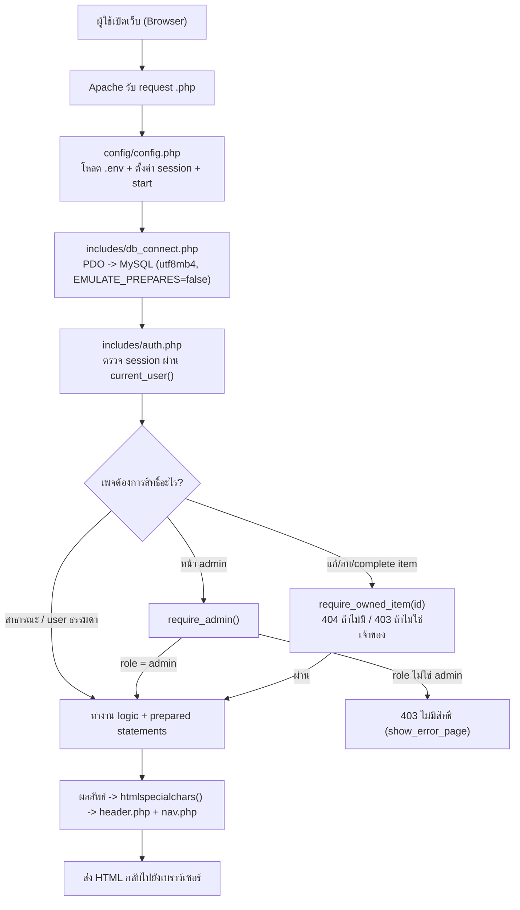
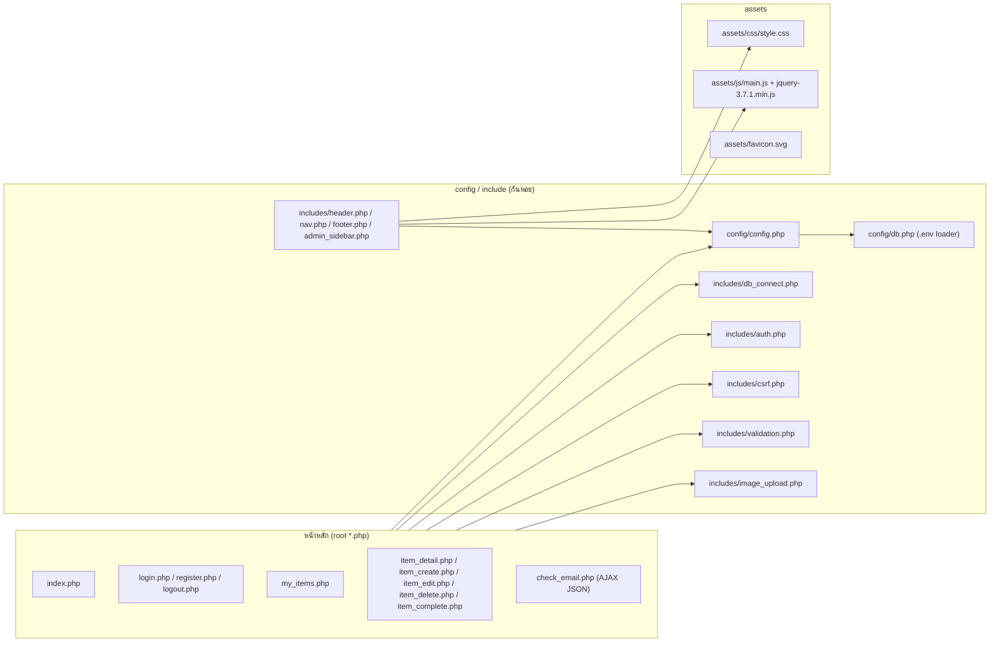
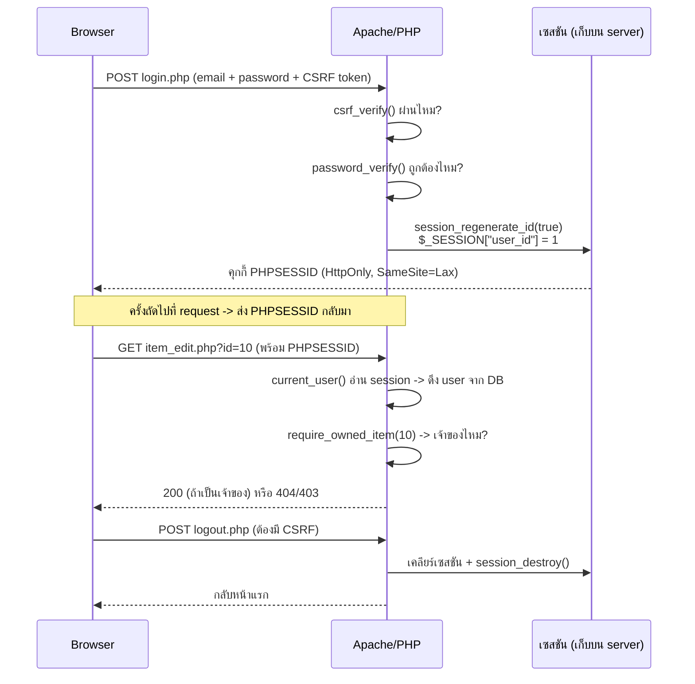
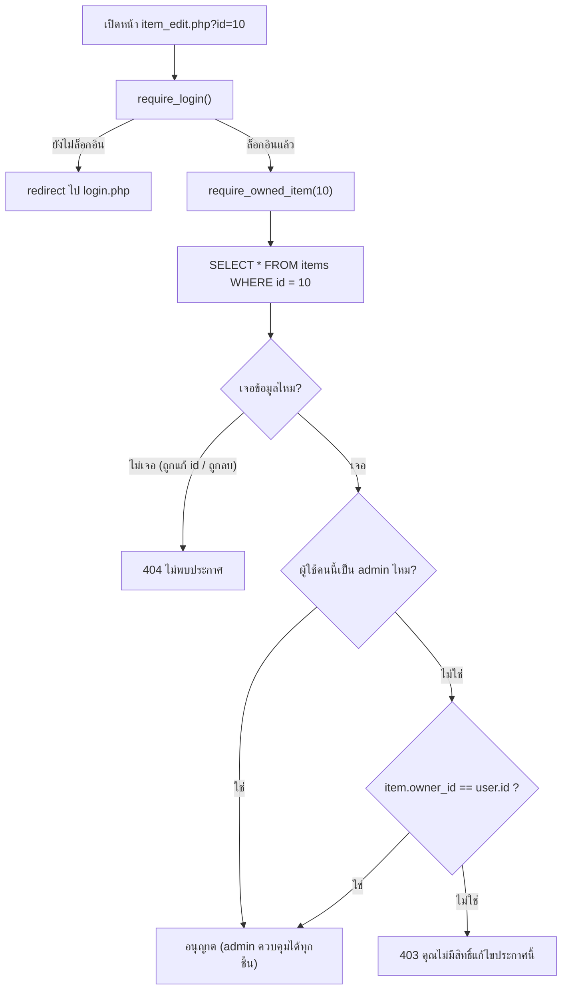
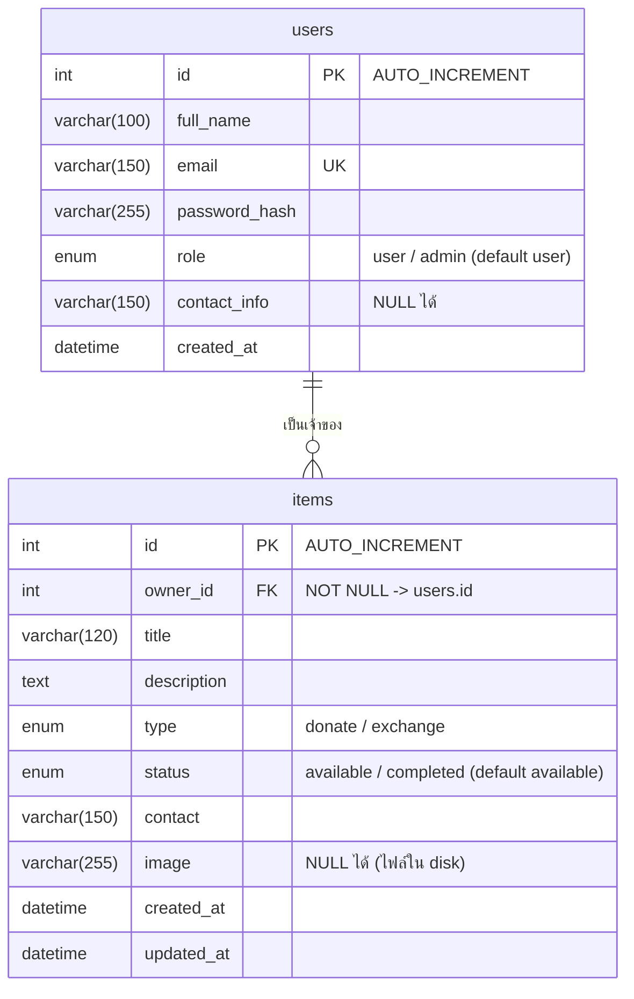

# PROJECT_DEFENSE_GUIDE.md — คู่มือเตรียมสอบแก้ตัว / นำเสนอโปรเจกต์ MSU Share & Care

> จุดประสงค์ของเอกสารนี้: เตรียมความพร้อมสำหรับการสอบแก้ตัว (Defense / Viva) ของโปรเจกต์
> **MSU Share & Care** โดยเนื้อหาทั้งหมดอ้างอิงจากโค้ดจริงในโปรเจกต์ (HEAD = commit `c3031c9`)
> และทำการแยกสถานะ **"ทำงานแล้วจริง" กับ "เคยทดสอบจริง (Local)" กับ "Production (ยังไม่พบหลักฐานยืนยัน)"**
> อย่างชัดเจนในทุกตอน
>
> ข้อสำคัญ:
> - เอกสารนี้ไม่เปิดเผยรหัสผ่านจริง, ค่าใน `.env`, รหัสเซสชัน, หรือข้อมูลส่วนตัวของผู้ใช้ใด ๆ
> - ถ้าอาจารย์ถามเรื่องที่ยังไม่มีหลักฐานยืนยัน ให้ตอบตรง ๆ ตามวิธีใน **บทที่ 14**
> - ทุกข้อความที่ลงท้ายด้วย **"ยังไม่พบหลักฐานยืนยัน"** หมายถึงยังไม่มีการตรวจสอบจริง ห้ามพูดเกินจริง

---

## สารบัญ

1. [บทสรุปโปรเจกต์ (เข้าใจภายใน 2 นาที)](#บทที่-1)
2. [สคริปต์นำเสนอ 30 วินาที / 1 นาที / 3 นาที](#บทที่-2)
3. [สถาปัตยกรรมระบบ + แผนภาพ](#บทที่-3)
4. [ตารางไฟล์ทั้งหมดและหน้าที่](#บทที่-4)
5. [ฐานข้อมูล: โครงสร้าง ความสัมพันธ์ และวิธีปรับ](#บทที่-5)
6. [อธิบายฟังก์ชันหลักแบบเจาะลึก](#บทที่-6)
7. [ความปลอดภัยทุกหมวด](#บทที่-7)
8. [งานปรับโฉม UI/UX (ทำอะไรไปบ้าง)](#บทที่-8)
9. [การติดตั้งและ Deploy](#บทที่-9)
10. [ตารางการทดสอบ: Local vs Production](#บทที่-10)
11. [ข้อจำกัดและสิ่งที่ยังไม่ได้ทำ](#บทที่-11)
12. [คลังคำถาม-คำตอบ 60+ ข้อ](#บทที่-12)
13. [สคริปต์ Demo 5–10 นาที (ไม่ต้องใช้รหัสผ่านจริง)](#บทที่-13)
14. [เทคนิคตอบเมื่อไม่รู้คำตอบ (ภาษาสุภาพ)](#บทที่-14)
15. [Cheat Sheet สรุป 1–2 หน้า](#บทที่-15)

---

<a name="บทที่-1"></a>
# บทที่ 1 — บทสรุปโปรเจกต์ (เข้าใจภายใน 2 นาที)

**MSU Share & Care** คือเว็บแอปพลิเคชันกระดานข่าว (Bulletin Board) สำหรับนักศึกษา
มหาสารคาม ให้แชร์ **ของที่ไม่ได้ใช้แล้ว** ผ่าน 2 วิธีคือ:

- **Donate (บริจาค)** — ส่งต่อให้ฟรี
- **Exchange (แลกเปลี่ยน)** — แลกสิ่งของกัน

**ผู้ใช้งานมี 2 บทบาท:**

| บทบาท | ทำอะไรได้ |
|---|---|
| **User (ผู้ใช้ทั่วไป)** | ดูประกาศ, ค้นหา, สมัครสมาชิก, เข้าสู่ระบบ, สร้าง/แก้ไข/ลบ/ทำเครื่องหมายเสร็จสิ้น ประกาศของตัวเองเท่านั้น, อัปโหลดรูปภาพ |
| **Admin (ผู้ดูแล)** | เข้า Dashboard, ดูสถิติรวม, จัดการผู้ใช้ทั้งหมด (เพิ่ม/แก้ไข/ลบ), จัดการประกาศทั้งหมด (แก้ไข/ลบ/ทำเครื่องหมายเสร็จ) |

**ขอบเขตที่ตั้งใจไม่ทำ** (ตาม `PROJECT.md`): ไม่มีระบบการเงิน, ไม่มีช่องแชต, ไม่มีระบบจัดส่ง,
ไม่มีการประมูล, ไม่มีระบบขอ-อนุมัติ — โปรเจกต์คือ **กระดานข่าวแชร์ของ** ไม่ใช่ร้านค้า

**สแต็กที่ใช้:** HTML5 + CSS3 + JavaScript + jQuery + AJAX (ตรวจอีเมลซ้ำ) + PHP 8 + MySQL (PDO) + Apache/XAMPP + Git

**จุดแข็งที่พร้อมตอบอาจารย์:**
1. ข้อมูลทุกช่องทางเข้าสู่ฐานข้อมูลเป็น **prepared statement** (กัน SQL Injection)
2. ทุก output ที่เอามาจาก user **escape ด้วย `htmlspecialchars()`** (กัน XSS)
3. ทุก action ที่เปลี่ยนสถานะ (login/register/create/edit/delete/complete/logout) มี **CSRF token**
4. การ authorize ทุกครั้ง **ตรวจที่ฝั่ง server** (`require_admin()`, `require_owned_item()`) — ไม่ได้ซ่อนปุ่มอย่างเดียว
5. รหัสผ่านเก็บแบบ **bcrypt** ด้วย `password_hash()` / `password_verify()` ไม่มีรหัสผ่านดิบในฐานข้อมูล
6. รองรับ **มือถือ/แท็บเล็ต/เดสก์ท็อป** (Responsive) ผ่าน CSS media queries + เมนูแฮมเบอร์เกอร์

---

<a name="บทที่-2"></a>
# บทที่ 2 — สคริปต์นำเสนอ

## 2.1 แบบ 30 วินาที (Elevator Pitch)

> "โปรเจกต์ของผมชื่อ MSU Share & Care เป็นเว็บกระดานข่าวสำหรับนักศึกษาให้แชร์ของที่ไม่ได้ใช้
> ผ่านการบริจาคหรือแลกเปลี่ยน ทำด้วย PHP + MySQL + HTML/CSS/JavaScript โดยไม่ใช้ Framework
>
> ระบบมีบทบาทผู้ใช้ 2 แบบ: ผู้ใช้ทั่วไปสร้างประกาศได้คนละหลายรายการ และแก้ไขได้เฉพาะของตัวเอง
> ส่วนแอดมินดูสถิติและจัดการผู้ใช้กับประกาศทั้งหมดได้
>
> จุดที่ผมให้ความสำคัญเป็นพิเศษคือความปลอดภัย: ทุกคำสั่งข้อมูลใช้ prepared statement ทุกหน้า
> escape output กัน XSS และมี CSRF token กันการยิงฟอร์มข้ามไซต์ การตรวจสิทธิ์ทำที่ฝั่ง server
> ทั้งหมด รหัสผ่านเก็บเป็น bcrypt"
---
> "เว็บนี้ผมทดสอบจริงบนเครื่องของตัวเอง (XAMPP) ทั้งการค้นหา การเข้าสู่ระบบ CRUD และการทดสอบ
> เปลี่ยน id ใน URL ว่าโดนปฏิเสธหรือไม่ สำหรับ Production ตอนนี้โค้ดชุดเดียวกันถูกอัปโหลดขึ้น Hosting
> แล้วตามที่ผู้ใช้แจ้ง แต่ยังไม่พบหลักฐานการทดสอบบน Hosting จริง"

## 2.2 แบบ 1 นาที (เพิ่มรายละเอียดระบบและตัวอย่างภาพ)

> (พูด 30 วินาทีแรกเหมือน 2.1 แล้วต่อ)
>
> "หน้าแรกแสดงประกาศทุกชิ้นพร้อมรูปภาพ คำค้นหา และตัวกรองประเภท (Donate/Exchange) กับสถานะ
> ผู้ใช้สมัครสมาชิกด้วยอีเมล รหัสผ่านต้องอย่างน้อย 8 ตัว ระบบตรวจอีเมลซ้ำทั้งแบบเรียลไทม์ด้วย AJAX
> และแบบตรวจซ้ำที่ server อีกครั้ง
>
> เมื่อล็อกอินแล้ว ผู้ใช้สร้างประกาศได้ ใส่ชื่อ รายละเอียด ประเภท ช่องทางติดต่อ และเลือกรูปภาพได้
> ไม่บังคับ ขนาดไม่เกิน 20 MB รองรับ JPG/PNG/GIF มีหน้าพรีวิวรูปก่อนโพสต์
>
> ผู้ใช้แก้ไข/ลบ/ทำเครื่องหมาย 'เสร็จสิ้น' ได้เฉพาะประกาศของตัวเองเท่านั้น เพราะ server ตรวจ
> `owner_id` เทียบกับ user_id ที่อยู่ใน session ทุกครั้ง ส่วนแอดมินดูภาพรวมสถิติและจัดการได้ทั้งหมด"

## 2.3 แบบ 3 นาที (เหมาะสำหรับตอนเปิดตัว / สไลด์แรก)

> (พูด 1 นาทีแรก แล้วเพิ่ม)
>
> "ผมขออธิบายโครงสร้างในระดับสูง: ทุกหน้ามีสายการทำงานเหมือนกัน คือ
> (1) โหลด `config/config.php` ซึ่งอ่านค่าความลับจากไฟล์ `.env` แล้ว start session
> (2) โหลดตัวเชื่อมฐานข้อมูล PDO
> (3) ตรวจว่าล็อกอินหรือยัง / เป็น admin หรือไม่ ผ่าน `includes/auth.php`
> (4) ทำงาน logic ด้วย prepared statement
> (5) เรนเดอร์ HTML ผ่าน `includes/header.php` + `includes/footer.php`
>
> ฐานข้อมูลมีแค่ 2 ตาราง: `users` กับ `items` เชื่อมกันด้วย foreign key `items.owner_id -> users.id`
> พร้อม `ON DELETE CASCADE` หมายความว่าถ้าแอดมินลบผู้ใช้ ประกาศของคนนั้นถูกลบตามโดยอัตโนมัติ
>
> สิ่งที่อยากเน้นคือการทดสอบ 3 ระดับ:
> 1) **Happy path**: สมัคร → สร้าง → แก้ → ทำเครื่องหมายเสร็จ → ลบ
> 2) **ผิดพลาด**: ค้นหาไม่เจอ, รูปเกิน 20MB, อีเมลซ้ำ, รหัสผ่านสั้น
> 3) **ไม่ได้รับอนุญาต**: ผู้ใช้ A แก้ของ B -> 403, ผู้ใช้ธรรมดาเปิด /admin -> 403, คนไม่ล็อกอิน -> redirect ไปหน้า login
>
> สำหรับ Hosting: ผมใช้ชุดไฟล์ commit `c3031c9` อัปโหลดขึ้นโฮสต์ ผู้ใช้เป็นคนดำเนินการเอง
> แต่การทดสอบบน Hosting จริงยังไม่พบหลักฐานยืนยัน ผมจึงตอบได้เต็มที่เฉพาะผลทดสอบบนเครื่องของผม"

---

<a name="บทที่-3"></a>
# บทที่ 3 — สถาปัตยกรรมระบบ + แผนภาพ

## 3.1 ภาพรวมการทำงานของ request (Mermaid)



## 3.2 โครงสร้างโมดูล (include แบบชั้นเดียว ไม่มี framework)



## 3.3 วงจรชีวิตเซสชัน (Session flow)



## 3.4 ขั้นตอนการ authorize การแก้ไขประกาศ (สำคัญมากสำหรับคำถามอาจารย์)



## 3.5 เหตุผลการออกแบบ (ใช้ได้กับคำถาม "ทำไมถึงเป็นแบบนี้")

| คำถาม | คำตอบสั้น |
|---|---|
| ทำไมไม่ใช้ React/Vue/Laravel? | หลักสูตรกำหนดให้ใช้ PHP + MySQL แบบเบสิก readable สำหรับนักศึกษา (ดู `PROJECT.md` / `AGENTS.md`) — ใช้ Native PHP ลดความซับซ้อน |
| ทำไมเป็น "หน้าชั้นเดียว + includes"? | ขนาดโปรเจกต์เล็ก มีหน้า ~13 หน้า 2 ตาราง การแยก function ที่ใช้ซ้ำไว้ใน `includes/` พอ — ไม่ over-engineer |
| ทำไม config อยู่คนละไฟล์กับ DB? | `config/db.php` คือตัวอ่าน `.env` + ตั้งค่า PDO; `config/config.php` ตั้งค่า session + เรียก db.php — แยกหน้าที่ย่อย อ่านง่าย |
| ทำไมต้องมี `.env`? | ค่าที่ต่างกันระหว่างเครื่อง เช่น host/port/user/password ของ DB ไม่อยู่ในโค้ด → ปลอดภัยต่อการ commit secrets |

---

<a name="บทที่-4"></a>
# บทที่ 4 — ตารางไฟล์ทั้งหมดและหน้าที่

## 4.1 หน้าหลัก (root)

| ไฟล์ | หน้าที่ | สิทธิ์ที่ต้องการ |
|---|---|---|
| `index.php` | หน้าแรก: แสดงประกาศทั้งหมด, ค้นหา (`q`), กรองประเภท/สถานะ, empty state | สาธารณะ |
| `login.php` | เข้าสู่ระบบ, ตรวจ CSRF, `password_verify`, `session_regenerate_id`, redirect หน้าแรก | สาธารณะ |
| `register.php` | สมัครสมาชิก, ตรวจซ้ำอีเมล, `password_hash`, role เป็น **user เสมอ** | สาธารณะ |
| `logout.php` | POST + CSRF เท่านั้น, เคลียร์ session + cookie, `/destroy`, redirect | ล็อกอินแล้ว |
| `check_email.php` | AJAX JSON: ตรวจรูปแบบ/อีเมลซ้ำ (คืน `{valid, available}`) | สาธารณะ (อ่านอย่างเดียว) |
| `my_items.php` | รายการประกาศของฉัน + ปุ่มสร้าง/แก้ไข/ลบ | ล็อกอินแล้ว |
| `item_detail.php` | หน้ารายละเอียดประกาศ: badges, รูป/placeholder, หากเป็นเจ้าของ/admin แสดงปุ่มจัดการ | สาธารณะ (ดูได้) |
| `item_create.php` | สร้างประกาศ + อัปโหลดภาพ (ไม่บังคับ) + validate | ล็อกอินแล้ว |
| `item_edit.php` | แก้ไขประกาศ (ตรวจ `require_owned_item`) + เปลี่ยน/ลบภาพ | เจ้าของ หรือ admin |
| `item_delete.php` | ลบประกาศ (POST + CSRF + `require_owned_item`) + ลบไฟล์ภาพ | เจ้าของ หรือ admin |
| `item_complete.php` | ทำเครื่องหมาย "เสร็จสิ้น" (POST + CSRF + `require_owned_item`) | เจ้าของ หรือ admin |

## 4.2 โฟลเดอร์ `config/`

| ไฟล์ | หน้าที่ |
|---|---|
| `config/config.php` | เรียก db.php, อ่าน `APP_DEBUG`, ตั้งค่า session (strict mode, only cookies, HttpOnly, SameSite=Lax), `session_start()` |
| `config/db.php` | อ่านไฟล์ `.env`, ฟังก์ชัน `env_value()`, `get_db_config()` คืนค่า host/port/name/user/password (มีค่า default ให้ลองใช้ local ก่อน) |

## 4.3 โฟลเดอร์ `includes/`

| ไฟล์ | หน้าที่ |
|---|---|
| `includes/db_connect.php` | `db_connect()` คืน PDO single instance; ERRMODE_EXCEPTION, FETCH_ASSOC, `EMULATE_PREPARES=false`; ถ้าเชื่อมไม่สำเร็จ -> error_log + HTTP 500 + ข้อความเดียว |
| `includes/auth.php` | `current_user()`, `is_logged_in()`, `app_url()`, `require_login()`, `require_admin()`, `show_error_page()`, `require_owned_item()` |
| `includes/csrf.php` | `csrf_token()` (random_bytes 32 -> hex ใน session), `csrf_field()`, `csrf_verify()` (POST เท่านั้น, ใช้ `hash_equals`) |
| `includes/validation.php` | `validate_required`, `validate_max_length` (mb_strlen), `validate_min_length`, `validate_email_format` (filter_var) |
| `includes/image_upload.php` | `handle_image_upload()`: จำกัด 20MB, `getimagesize`, เฉพาะ JPG/PNG/GIF, ชื่อ random 16 ไบต์ hex, ย้ายไฟล์ไป `uploads/`; `delete_uploaded_image()` |
| `includes/header.php` | `<head>` (meta, viewport, theme-color, Google Fonts Prompt + Noto Sans Thai, favicon, CSS cache-buster `?v=20261010-2`), เปิด `<nav>` + `<main>` |
| `includes/nav.php` | เมนูบน: หน้าแรก, ประกาศของฉัน (ล็อกอิน), Admin (role=admin), ปุ่ม login/register/CTA, skip-link, แฮมเบอร์เกอร์มือถือ |
| `includes/footer.php` | ปิด main, โหลด jQuery + main.js |
| `includes/admin_sidebar.php` | เมนูข้างสำหรับหน้า admin (ภาพรวม/ผู้ใช้/ประกาศ) |

## 4.4 โฟลเดอร์ `admin/`

| ไฟล์ | หน้าที่ | สิทธิ์ |
|---|---|---|
| `admin/dashboard.php` | สถิติรวม (ผู้ใช้/ประกาศ/available/completed/donate/exchange) ด้วย subquery + ตารางอัปเดตล่าสุด | `require_admin()` |
| `admin/users.php` | ตารางผู้ใช้ทั้งหมด + จำนวนประกาศต่อคน + ปุ่มแก้ไข/ลบ | `require_admin()` |
| `admin/user_create.php` | เพิ่มผู้ใช้ (เลือก role ได้ผ่าน allowlist ['user','admin']) | `require_admin()` |
| `admin/user_edit.php` | แก้ไขผู้ใช้ (ชื่อ/อีเมล/role/ช่องทางติดต่อ; เปลี่ยนรหัสได้ถ้าช่องไม่ว่าง) | `require_admin()` |
| `admin/user_delete.php` | ลบผู้ใช้ (POST + CSRF): ห้ามลบตัวเอง, ห้ามลบแอดมินคนสุดท้าย, ลบภาพประกาศก่อน, ลบ user (CASCADE ลบ items) | `require_admin()` |
| `admin/items.php` | ตารางประกาศทั้งหมด + ลบโดยตรง (POST + CSRF) + ลิงก์แก้ไข | `require_admin()` |

## 4.5 Assets และไฟล์อื่น ๆ

| ไฟล์ | หน้าที่ |
|---|---|
| `assets/css/style.css` | ดีไซน์ทั้งหมด (design tokens, layout, components, responsive) |
| `assets/js/main.js` | เมนูมือถือ, confirm dialog (`data-confirm`), พรีวิวรูป, AJAX ตรวจอีเมล |
| `assets/js/jquery-3.7.1.min.js` | jQuery |
| `assets/favicon.svg` | โลโก้เว็บ |
| `sql/schema.sql` | DDL สร้างตาราง `users` + `items` |
| `.htaccess` | ปิด directory listing; บล็อก access ไป `sql/config/includes/.git`, ไฟล์ที่ขึ้นต้นด้วย `.`, ไฟล์ `.sql/.md` |
| `uploads/.htaccess` | ห้ามรัน PHP ใน uploads + ปิด listing |
| `.env.example` | ตัวอย่างตัวแปร (ไม่มีค่าจริง): APP_DEBUG, DB_HOST/PORT/NAME/USER/PASS |
| `.gitignore` | กันไฟล์ secrets / cache / เฉพาะที่ไม่ควร commit |

---

<a name="บทที่-5"></a>
# บทที่ 5 — ฐานข้อมูล

## 5.1 โครงสร้าง (จาก `sql/schema.sql`)



**ข้อเท็จจริงที่แน่นอน (จาก schema.sql):**

- ฐานข้อมูลมี **2 ตาราง** คือ `users` และ `items`
- Engine: **InnoDB**, Collation: **utf8mb4_unicode_ci** (รองรับภาษาไทยและอีโมจิ)
- Foreign key: **`fk_items_owner`** = `items.owner_id -> users.id` แบบ **`ON DELETE CASCADE`**
- Index: `idx_items_status`, `idx_items_type` (ช่วยให้กรองเร็ว)
- `users.email` เป็น **UNIQUE** (กันอีเมลซ้ำที่ระดับฐานข้อมูลด้วย)
- `items.status` DEFAULT = `'available'`; `users.role` DEFAULT = `'user'`
- **ไม่มีตารางเพิ่งเพิ่ม**: ไม่มีตาราง admin แยก, ไม่มีตาราง messages, ไม่มีตาราง transactions

## 5.2 ความสัมพันธ์

- **1 บัญชีมีได้หลายประกาศ** (`users 1 --- N items`)
- การลบผู้ใช้ -> ประกาศทั้งหมดโดนลบตาม **โดยอัตโนมัติจาก CASCADE** และโค้ดใน
  `admin/user_delete.php` ลบไฟล์ภาพประกอบประกาศด้วย (เพื่อไม่ให้ภาพค้างใน disk)

## 5.3 การเปลี่ยนฐานข้อมูล: มีหรือไม่มี migration tool?

- **ไม่มี** migration/ORM (ตามสเปก เน้นความเรียบง่าย)
- การเปลี่ยน schema ทำ 2 ทาง:
  1. แก้ `sql/schema.sql` แล้ว import ใหม่ (เหมาะสำหรับ DBใหม่ / รีโหลด dev)
  2. เขียนคำสั่ง ALTER เองแล้วบันทึกไว้ที่ไหนสักแห่ง เช่น `docs/` หรือ commit ใหม่ (เหมาะกับ DB ที่มีข้อมูลแล้ว)
- ระหว่าง deploy: `sql/schema.sql` ในชุด release **มีแต่ CREATE TABLE (DDL)** — ไม่มี DROP/INSERT/UPDATE
  จึงปลอดภัยต่อการยิงทับ (ได้ตรวจสอบจริงกับชุด release `c3031c9`)

## 5.4 ภาพไม่ได้เก็บในฐานข้อมูล

- ตาราง `items.image` เก็บแค่ **path** เช่น `uploads/<ชื่อไฟล์-random>` — ตัวไฟล์จริงอยู่บน disk
- ประโยชน์: DB เล็ก, การย้าย/กู้ภาพง่าย; ข้อเสีย: ต้องดูแลไฟล์ให้ตรงกับ DB (โค้ดมี `delete_uploaded_image()` คอยลบ)

---

<a name="บทที่-6"></a>
# บทที่ 6 — อธิบายฟังก์ชันหลักแบบเจาะลึก

## 6.1 การเข้าสู่ระบบ — `login.php`

เส้นทางโค้ดจริง:

1. POST + `csrf_verify()` (ผิด -> error "เซสชันหมดอายุ")
2. validate_required อีเมล, รหัสผ่าน (ไลน์ 22, 27)
3. `SELECT id, password_hash FROM users WHERE email = ?` (ไลน์ 33) — **prepared**
4. `$user === false || !password_verify(...)` -> error เดียวกันหมดว่า "อีเมลหรือรหัสผ่านไม่ถูกต้อง" (ไลน์ 39) — **ไม่บอกว่ารอไปเปิดเผยว่าอีเมลมีอยู่จริงหรือไม่ (กัน user enumeration)**
5. สำเร็จ -> `session_regenerate_id(true)` (ไลน์ 42) + เก็บ `$_SESSION['user_id']` (ไลน์ 43) -> redirect หน้าแรก

## 6.2 สมัครสมาชิก — `register.php`

1. ตรวจ CSRF -> validate: required/max length ชื่อ(100), email format(150), password min 8, ยืนยันรหัสตรงกัน, contact(max 150)
2. ตรวจอีเมลซ้ำ: `SELECT id FROM users WHERE email = ?` (ไลน์ 76)
3. `password_hash($password, PASSWORD_DEFAULT)` (ไลน์ 85) เก็บเป็น bcrypt
4. `INSERT INTO users (full_name, email, password_hash, contact_info) VALUES` (ไลน์ 88) — **ไม่ได้ส่ง role จาก client** -> role = `user` เสมอ
5. `session_regenerate_id(true)` + ฝาก `lastInsertId()` ไว้ใน session (ไลน์ 98–99) -> ล็อกอินอัตโนมัติ -> redirect

## 6.3 ฟังก์ชันใน `includes/auth.php`

| ฟังก์ชัน | ทำอะไร | จุดเด่น |
|---|---|---|
| `current_user()` | อ่าน `$_SESSION['user_id']` -> SELECT จาก users (prepared) | แคชใน static; ถ้า user ไม่อยู่ใน DB แล้ว -> เคลียร์ session |
| `app_url($path)` | เติม `basePath` หน้า path | ทำให้รองรับการติดตั้งในโฟลเดอร์ย่อย (htdocs/โปรเจกต์) |
| `require_login()` | ยังไม่ล็อกอิน -> redirect `login.php` | ใช้กับหน้า "ประกาศของฉัน" เป็นต้น |
| `require_admin()` | เรียก require_login ก่อน แล้วเช็ค `role !== 'admin'` -> 403 ผ่าน `show_error_page()` | ตรวจที่ server ทุกหน้า admin |
| `show_error_page()` | ตั้ง HTTP code (เช่น 403/404/400), เรนเดอร์หน้า error สวย ๆ แล้ว exit | message ผ่าน htmlspecialchars |
| `require_owned_item($id)` | SELECT item -> ไม่เจอ -> 404; ถ้า admin -> ผ่าน; `owner_id !== user_id` -> 403 | **หัวใจของ Ownership Test** |

## 6.4 Item CRUD — core 4 หน้า

| หน้า | flow | จุดที่ต้องตอบอาจารย์ |
|---|---|---|
| `item_create.php` | login -> validate (title ≤120, desc ≤5000, type ใน allowlist, contact ≤150, image ไม่บังคับ) -> `handle_image_upload()` -> INSERT -> redirect ไป detail | validation ฝั่ง server ถือเป็นหลัก, HTML `required`/maxlength เป็นตัวช่วยเท่านั้น |
| `item_edit.php` | login -> id>0 ไม่งั้น 404 -> `require_owned_item()` (404/403/ผ่าน) -> validate -> จัดการภาพ (อัปโหลดใหม่ / ติ๊กลบภาพ / เก็บภาพเดิม) -> UPDATE 2 คำสั่งเตรียมไว้ | `require_owned_item` เรียก **ก่อน** แสดงฟอร์ม -> ชนะเงินการดัด id |
| `item_delete.php` | POST เท่านั้น -> login -> CSRF -> id>0 ไม่งั้น 404 -> `require_owned_item` -> DELETE (admin ลบด้วย id, user ลบด้วย `id + owner_id=?`) -> `delete_uploaded_image()` -> redirect | ลบข้อมูล + ลบไฟล์ภาพด้วย |
| `item_complete.php` | POST -> login -> CSRF -> id>0 -> `require_owned_item` -> UPDATE status='completed' โดยมีเงื่อนไข `status='available'` (กันทำซ้ำ) | เปลี่ยนสถานะตามจริง เราไม่ลบของออกจากระบบ |

## 6.5 หน้าแรก / ค้นหา — `index.php`

- อ่าน `q`, `type`, `status` จาก GET
- **Allowlist**: `type` อนุญาตแค่ `donate|exchange`, `status` แค่ `available|completed`; ค่าผิด -> ไม่กรอง
- SQL: `INNER JOIN users ON users.id = items.owner_id` + `WHERE 1=1` + เติมเงื่อนไข `LIKE ?` บน title/description + กรอง type/status + `ORDER BY created_at DESC, id DESC`
- ใช้ **prepared statement** ค่าทุกค่าผ่าน `?` (รวม `%keyword%`)
- ผลไม่เจอ -> แสดง **empty state + ปุ่ม "ล้างตัวกรอง"** (`$hasFilter`)

## 6.6 การอัปโหลดภาพ — `includes/image_upload.php`

ตรวจทีละขั้นในฟังก์ชัน `handle_image_upload(&$errors)`:
- ขนาด ≤ 20 MB (อ่านจาก `$_FILES`)
- `getimagesize()` พิสูจน์ว่าเป็นภาพจริง (ไม่ใช่ไฟล์ปลอมที่แค่ต่อท้าย .jpg)
- อนุญาตเฉพาะ `jpeg/jpg/png/gif` เท่านั้น
- **ชื่อไฟล์ random** `bin2hex(random_bytes(16))` -> ป้องกันชนชื่อ + ทำให้คาดเดา path ไม่ได้ -> ย้ายเข้า `uploads/`
- คืน `uploads/<ชื่อ>` ไปใส่ใน column `image`; ถ้าไม่มีไฟล์ -> null

## 6.7 Admin

| หน้า | วิธีทำงาน |
|---|---|
| `dashboard.php` | query เดียวพร้อม subquery 6 ตัวนับจำนวน (users/items/available/completed/donate/exchange) + 2 query กลุ่มล่าสุด |
| `users.php` | รายการ user + subquery `COUNT(*)` ของ items ต่อคน |
| `user_create.php` / `user_edit.php` | ฟอร์มเดียวกับ register แต่มี **role select** ตรวจด้วย `in_array(..., ['user','admin'])` |
| `user_delete.php` | กันตัวเอง: `id === currentAdmin.id` -> 400 "ลบตัวเองไม่ได้"; กันแอดมินสุดท้าย: `COUNT(role='admin')` ถ้าเหลือ 1 -> 400; ลบภาพของ items ทั้งหมด แล้ว DELETE user (CASCADE ลบ items) |
| `items.php` | รายการประกาศทั้งหมด + ลบผ่าน POST+CSRF |

## 6.8 JavaScript — `assets/js/main.js`

- `.nav-toggle` สลับคลาส `.is-open` + sync `aria-expanded` (เมนูมือถือ)
- ปิดเมนูเมื่อกดลิงก์/ปุ่มตอนจอ ≤ 760px; กด `Escape` ปิด + โฟกัสกลับที่ปุ่ม (accessibility)
- ตารางที่ใส่ `data-confirm` -> `window.confirm()` ก่อน submit (ยืนยันการลบ)
- พรีวิวรูปด้วย FileReader + uncheck กล่อง "ลบภาพ"
- AJAX `$.getJSON('check_email.php', {email})` ตอนออกจากช่องอีเมล -> แสดง "ใช้ได้/ถูกใช้แล้ว" (ฝั่ง server ตรวจซ้ำจริงอีกที)

---

<a name="บทที่-7"></a>
# บทที่ 7 — ความปลอดภัย (แน่นอนที่สุดที่อาจารย์จะถาม)

## 7.1 ตารางรวม: ภัยคุกคาม vs การป้องกัน vs ไฟล์จริง

| ภัย | การป้องกัน | โค้ดจริง |
|---|---|---|
| **SQL Injection** | prepared statement ทุก query + `EMULATE_PREPARES=false` | `includes/db_connect.php`, ทุกไฟล์ที่ใช้ `->prepare()` |
| **XSS (Stored/Reflected)** | `htmlspecialchars($x, ENT_QUOTES, 'UTF-8')` ทุกจุดที่ echo ข้อมูล user | `index.php`, `nav.php`, `header.php`, `item_edit.php`, หน้า admin ทุกหน้า |
| **CSRF** | token `random_bytes(32)` ใน session, ตรวจ POST ด้วย `hash_equals` | `includes/csrf.php` + `csrf_field()` ในทุกฟอร์ม |
| **Session Hijacking** | `session_regenerate_id(true)` ตอน login/register; cookie HttpOnly, SameSite=Lax, strict mode, only-cookies | `login.php:42`, `register.php:98`, `config/config.php` |
| **Password leak** | bcrypt ผ่าน `password_hash(PASSWORD_DEFAULT)`; ไม่ log password | `register.php:85`, `login.php:39` |
| **User enumeration** | login error เป็นข้อความเดียว "อีเมลหรือรหัสผ่านไม่ถูกต้อง" | `login.php:40` |
| **เข้าสู่ endpoint addr ไปผิด** | `require_admin()` -> 403, `require_owned_item()` -> 404/403 ทุกครั้ง | `includes/auth.php:56,81` |
| **ดูไฟล์ secrets / config** | `.htaccess` บล็อก config/sql/.git/dotfiles; `.env` ถูก block ด้วย FilesMatch `^\.` | `.htaccess` |
| **รัน PHP ใน uploads** | `uploads/.htaccess` ห้ามรัน PHP + `Options -Indexes` | `uploads/.htaccess` |
| **อัปโหลดไฟล์อันตราย** | จำกัด 20MB, `getimagesize`, allowlist JPG/PNG/GIF, ชื่อ random | `includes/image_upload.php` |
| **ข้อมูลที่ซ้ำ/ยาวเกิน** | UNIQUE + max length ตรวจทั้งฝั่ง server | schema `email UNIQUE`, `validation.php`, `item_create.php` |
| **Role ปลอมจาก client** | การตั้ง role มีแค่ฟอร์ม admin + allowlist; การสมัครเองเป็น `user` เสมอ | `register.php:88`, `admin/user_create.php:68` |
| **Directory listing** | `Options -Indexes` ใน `.htaccess` | `.htaccess` |
| **ข้อมูล error หลุด** | `APP_DEBUG`; DB fail -> error_log + ข้อความเดียว | `config/config.php`, `db_connect.php` |
| **ความลับใน repo** | `.env` gitignored; ไว้ค่า placeholder ใน `.env.example` | `.gitignore`, `.env.example` |

## 7.2 ตัวอย่างถาม-ตอบไว (แบบพูดปากเปล่า)

**"ทำไมต้อง prepared statement?"**
> "ผมไม่เอา SQL มาประกบกับ input โดยตรง แต่ส่ง query ที่มีเครื่องหมาย `?` ให้ MySQL
> ค่าของผู้ใช้ถูกส่งเป็นพารามิเตอร์แยก ทำให้พยายามแทรกคำสั่งอย่าง `' OR '1'='1` กลายเป็นแค่ข้อความธรรมดา
> และผมปิด `EMULATE_PREPARES=false` เพื่อให้เตรียมสถิติจริงฝั่ง MySQL"

**"ทำไมต้อง escape output?"**
> "ถ้าคนโพสต์ชื่อประกาศว่า `<script>alert(1)</script>` แล้วเราพิมพ์ตรง ๆ เบราว์เซอร์จะรันสคริปต์
> ในชื่อของเรา `htmlspecialchars()` แปลง `<`, `>`, `"`, `'` ให้เป็น entity ทำให้มันแสดงเป็นข้อความเฉย ๆ"

**"ทำไม token CSRF ถึงกันการโจมตีได้?"**
> "ทุกฟอร์มที่เปลี่ยนข้อมูลจะมี hidden token ที่สร้างจาก `random_bytes(32)` เก็บไว้ใน session
> ฝั่ง server ตรวจด้วย `hash_equals()` ว่า token ที่ส่งมาตรงกับใน session พอดี
> เว็บมัลแวร์ไม่รู้จัก token ของเรา มันยิงฟอร์มข้ามไซต์มาก็ไม่ผ่าน"

**"ทำไมต้อง regenerate session id?"**
> "ตอนล็อกอิน session id เดิมอาจถูกดักได้ (session fixation) การ `session_regenerate_id(true)`
> ออก id ใหม่แล้วตัดของเก่าทิ้ง ทำให้ id ที่หมดอายุใช้ไม่ได้ ไม่ใช่คนที่ล็อกอิน"

**"ทำไม hash เก็บเป็น varchar(255)?"**
> "bcrypt ผ่าน `PASSWORD_DEFAULT` ปัจจุบันได้ 60 ตัวอักษร แต่ถ้า PHP อัปเกรดอัลกอริทึมในอนาคต
> ความยาวอาจเพิ่ม เป็น 255 เพื่อรองรับล่วงหน้า"

**"การลบ user ทำไมรายการของเขาหายไป?"**
> "FK `items.owner_id → users.id` มี `ON DELETE CASCADE` ระบบจึงลบประกาศของคนนั้นตามอัตโนมัติ
> และโค้ดใน `user_delete.php` ยังลบไฟล์ภาพให้ด้วย"

---

<a name="บทที่-8"></a>
# บทที่ 8 — งานปรับโฉม UI/UX (ทำอะไรไปบ้าง)

โปรเจกต์ผ่านงาน **redesign ครั้งใหญ่** ใน commit `c3031c9` (หลัง QA ก่อนส่ง) งานที่ทำ:

## 8.1 อะไรเปลี่ยนไป (ก่อน → หลัง)

| ด้าน | ก่อน | หลัง (c3031c9) |
|---|---|---|
| ธีมสี | สีน้ำเงิน/เน้น delete | teal ที่เป็นมิตร: primary `#437B98`, secondary `#4CAF97`, accent `#F4C430`, bg `#E8F2F1` |
| ฟอนต์ | ระบบ | **Prompt + Noto Sans Thai** จาก Google Fonts (อ่านไทยชัด) |
| Navbar | เรียบง่าย | brand + สโลแกนรอย, skip-link (accessibility), แฮมเบอร์เกอร์มือถือ + aria-expanded, ปุ่ม CTA |
| หน้าแรก (Landing) | ตาราง/ลิสต์ | hero "ของที่คุณไม่ใช้ อาจเป็นโอกาสของใครอีกคน", การ์ดประกาศพร้อม badges, empty state + ล้างตัวกรอง |
| บัตรประกาศ | ธรรมดา | รูป/placeholder, badges Donate/Exchange (สีต่าง), Available/Completed, เจ้าของ |
| ฟอร์ม login/register/create | พื้นๆ | `.auth-wrap`, `.form-box`, `.form-section-title`, radio พร้อมคำอธิบายไทย |
| Admin | เดิมเป็นหน้าธรรมดา | `.admin-layout` + `admin_sidebar.php`, stat cards + icon SVG, `.data-table` สวย, badges admin/user |
| อัปโหลดรูป | ปุ่มไฟล์ธรรมดา | `.file-upload-label` + แสดงชื่อไฟล์ + **พรีวิว 1:1** + hint "ไม่เกิน 20MB" |
| ตัวแปร CSS | ค่าฮาร์ดโค้ด | design tokens ใน `:root` (ตั้งแต่ commit ก่อนหน้า) |
| Cache CSS | อ่านค่าแคชเก่าได้ | เพิ่ม cache-buster CSS `?v=20261010-2` |

## 8.2หน้าจอ/Responsive

- Breakpoints: 1120 / 900 / 760 / 560 / 420 px
- ทดสอบจริง 5 ขนาดจอ (1440, 1366, 768, 390, 360): หน้า public **ไม่มี overflow แนวนอน**
- เมนูมือถือ: กด `.nav-toggle` -> เพิ่ม `.is-open` + ตั้ง `aria-expanded`; กดลิงก์/ESC ปิดเอง

## 8.3 ปัญหาที่พบระหว่าง QA และแก้จริง

- **Bug ที่เจอ**: หน้า admin ล้นจอทางแนวนอนที่ 390px (พบจาก screenshot QA)
- **สาเหตุ**: `.admin-layout` / `.admin-sidebar` ไม่มี `min-width: 0` ทำให้ไม่บีบใน grid
- **แก้**: เพิ่ม `min-width: 0` ใน media query ≤900px -> ตรวจซ้ำ 390/768/1366 **ผ่านหมด**

## 8.4 งานที่ไม่เกี่ยวข้องกับดีไซน์ในรอบที่ผ่านมา

- จุดนี้เป็น **UI-only commit**: ไม่มีการเปลี่ยน logic ของ auth / CSRF / ownership / database
- มีตรวจสอบก่อน commit ว่าไม่มีการแก้ `config/`, `includes/auth.php`, โครงสร้าง DB

---

<a name="บทที่-9"></a>
# บทที่ 9 — การติดตั้งและการ Deploy

## 9.1 ติดตั้งบนเครื่องตัวเอง (XAMPP / Local)

อ้างอิง: `README.md` §6 (ทำตามขั้นตอนจริงมาแล้วบนเครื่องผู้พัฒนา)

1. แตกโปรเจกต์ไปไว้ใต้ `C:\xampp\htdocs\Term_Project_002`
2. เปิด XAMPP: start **Apache** + **MySQL**
3. สร้างไฟล์ `.env` โดย copy จาก `.env.example` แล้วใส่ค่าฐานข้อมูลของเครื่อง
4. import `sql/schema.sql` ผ่าน phpMyAdmin หรือคำสั่ง mysql
5. เปิดเบราว์เซอร์ `http://localhost/Term_Project_002` (บนเครื่องผู้พัฒนาใช้ `http://127.0.0.1:8087`)
6. สมัครสมาชิก / ล็อกอิน; สร้างบัญชี admin ตาม `README.md` §7

**คำเตือนที่ต้องจำ:** `.env` ของจริง**ห้าม commit** (อยู่ใน `.gitignore` แล้ว); ตอน commit มีแต่ `.env.example`

## 9.2 Deploy บนโฮสต์ (ตาม DEPLOY.md / PROJECT_SUMMARY.md §10)

ขั้นตอนทั่วไป:

1. อัปโหลด content ของ release package ขึ้นโฮสต์ (เช่น InfinityFree)
2. สร้างฐานข้อมูล MySQL ผ่าน control panel ของโฮสต์ -> import `sql/schema.sql`
3. สร้าง `.env` ที่ host ใหม่ โดยใส่ host/ชื่อ/user/password ของ host นั้น ๆ (**ค่าต่างจาก local**)
4. ตั้ง `APP_DEBUG=false` หลังทำเสร็จ
5. ถ้าเกิด **HTTP 500** หลังอัปโหลด: สาเหตุหนึ่งที่รู้จักคือ `Options -Indexes` ใน `.htaccess`
   ที่บางโฮสต์ไม่อนุญาต -> ลบ/คอมเมนต์บรรทัดนั้นใน `.htaccess` และ `uploads/.htaccess`
   (วิธีนี้ทำจริงแล้วตอน deploy ก่อนหน้า และบันทึกไว้ใน docs)
6. ทดสอบหน้าแรก + login หลัง deploy

## 9.3 สถานะ Production ของโปรเจกต์นี้

- **ผู้ใช้แจ้งว่าได้อัปโหลดขึ้น Hosting แล้ว** (ยังไม่พบ URL / ไม่มีหลักฐานยืนยันการทดสอบ)
- ชุดไฟล์ที่เตรียมไว้: `release/msu-share-care-c3031c9.zip` (ตรวจ integrity แล้ว 40/40 ไฟล์, checksum 39/39)
- มี `release/UPDATE-INSTRUCTIONS.md` อธิบายวิธีอัปเกรดทับเดิม + ขั้น backup/rollback

---

<a name="บทที่-10"></a>
# บทที่ 10 — ตารางทดสอบ: Local vs Production

> **หลักฐานแบ่ง 3 สถานะ:**
> - ✅ **เคยทดสอบจริง (Local)** — ผมทำจริงบน XAMPP ผ่านเบราว์เซอร์/DevTools (session ปัจจุบัน)
> - 🔶 **มีโค้ดรองรับ / เคยพัฒนา** — มี logic อยู่ในโค้ด แต่ไม่ได้รันซ้ำในรอบนี้
> - ⛔ **ยังไม่พบหลักฐานยืนยัน** — ยังไม่มีการตรวจสอบจริง (โดยเฉพาะ Production)

## 10.1 ตาราง "รู่อะไรจริง"

| รายการทดสอบ | ผล | สถานะ |
|---|---|---|
| หน้าแรก `index.php` โหลด 200, มี hero, การ์ดประกาศ, ค้นหา | ผ่าน | ✅ Local |
| ค้นหา: ไม่ตรง keyword (q=random) -> empty state + ปุ่มล้างตัวกรอง | ผ่าน | ✅ Local |
| ค้นหาเจอ 1/5 รายการ (เช่น "หนังสือ") | ผ่าน | ✅ Local |
| ทุกหน้าหลัก + หน้า admin (ผู้ใช้ล็อกอินแล้ว) ตอบ 200 | ผ่าน | ✅ Local |
| หน้าเก็บ auth โดนคนไม่ล็อกอิน -> redirect ไป `login.php` | ผ่าน | ✅ Local |
| Static assets (css/favicon/js) 200 | ผ่าน | ✅ Local |
| Responsive 5 ขนาดจอ public pages ไม่มี overflow แนวนอน | ผ่าน | ✅ Local |
| เมนูมือถือเปิด/ปิด (class `.is-open` + aria-expanded) | ผ่าน | ✅ Local |
| หน้า admin จอ 390px ไม่มี overflow (หลังแก้ `min-width:0`) | ผ่าน | ✅ Local |
| Console error ฝั่ง JS | 0 error | ✅ Local |
| 404 ที่เหลือ = รูป `uploads/...png` ของ item id 19 ไม่มีไฟล์จริง | (รู้สาเหตุ) | ✅ Local (พบแล้ว) |
| Login admin ผ่านฟอร์มจริง | ผ่าน | ✅ Local |
| หน้าเว็บบน Hosting โหลด/เข้าสู่ระบบ/CUD | ยังไม่ได้ตรวจ | ⛔ ยังไม่พบหลักฐานยืนยัน |

## 10.2 ชุดทดสอบอัตโนมัติ (ใน repo)

- มีโฟลเดอร์ `tests/` พร้อมสคริปต์ทดสอบ (มีมาตั้งแต่ commit `0ac24e6`; เพิ่มกรณีภาพ+อีเมลใน
  `00ca52f`/`4a78813` — ดู `README.md` §13)
- **รอบนี้ยังไม่ได้รันซ้ำ** → ถ้าจะอ้างผลชุดทดสอบ ควรไปรันให้ผ่านก่อนวันนำเสนอ แล้วนำ log มาด้วย

## 10.3 ต้องบอกอาจารย์ให้ชัดเจนเสมอ

> "ผมทดสอบจริงทุกข้อบนเครื่อง XAMPP ด้วยตัวเอง สำหรับบน Hosting ผู้ใช้เป็นคนอัปโหลดเอง
> โค้ดชุดเดียวกับที่ผมทดสอบ แต่ **ยังไม่พบหลักฐานยืนยันการทดสอบบน Production** ผมจึงตอบได้
> แค่ผลที่ทดสอบบนเครื่องของผม"

---

<a name="บทที่-11"></a>
# บทที่ 11 — ข้อจำกัดและสิ่งที่ยังไม่ได้ทำ

| # | ข้อ | รายละเอียด |
|---|---|---|
| 1 | ข้อมูลภาพของ item id 19 ("hy") หายจาก disk | ยังมี path อ้างถึงใน DB แต่ไฟล์ไม่อยู่ -> แสดงรูปแตก (เป็นปัญหาข้อมูลเดิม ไม่ได้แก้ เพื่อไม่ยุ่งกับข้อมูลผู้ใช้) |
| 2 | ไม่มีระบบ "ลืมรหัสผ่าน" / reset | ต้องแก้รหัสผ่านผ่าน admin หรือแก้ DB |
| 3 | ไม่มีการส่งอีเมลจริงเลย | แค่ตรวจอีเมลซ้ำเท่านั้น ไม่มี verify email |
| 4 | ไม่มี remember me / auto login | เซสชันหมดเมื่อปิดเบราว์เซอร์ (เจตนา) |
| 5 | ไม่มี pagination | รายการเยอะ ๆ ยังแสดงหมดในหน้าเดียว |
| 6 | ไม่มีระบบแจ้งเตือน/แชต | ตามขอบเขต `PROJECT.md` ห้ามเพิ่มโดยไม่ได้รับอนุมัติ |
| 7 | ไม่มีการตั้งค่าข้อมูลโฮสต์เป็นระบบอัตโนมัติ | ต้องสร้าง `.env` เองในแต่ละเครื่อง |
| 8 | ไม่มี migration tool / seed ทดสอบอัตโนมัติเต็มรูปแบบ | มีแค่ `schema.sql` + `tests/` |
| 9 | `Options -Indexes` อาจชนะ host บางตัว | ต้องลบบรรทัดนั้น (บันทึกวิธีไว้ใน docs) |
| 10 | ยังไม่พบหลักฐานยืนยันการทดสอบบน Production | ควรทดสอบซ้ำบนโฮสต์จริงก่อนนำเสนอเพื่อให้ธรรมชาติเชื่อถือ |

---

<a name="บทที่-12"></a>
# บทที่ 12 — คลังคำถาม-คำตอบ 66 ข้อ

## หมวด A — ภาพรวมและความต้องการ (Requirement)

**1. โปรเจกต์นี้คืออะไร?**
เว็บกระดานข่าว (Bulletin Board) ให้นักศึกษาแชร์ของที่ไม่ได้ใช้ ผ่านการบริจาค (Donate) หรือแลกเปลี่ยน (Exchange) ทำด้วย PHP/MySQL/HTML/CSS/JS แบบ native

**2. ใครคือผู้ใช้?**
สองบทบาท: User (สร้าง/จัดการประกาศของตัวเอง) และ Admin (จัดการทั้งระบบ). ใครก็ดูประกาศได้โดยไม่ต้องล็อกอิน

**3. ฟีเจอร์ไฮไลต์ของระบบ?**
สมัคร/ล็อกอิน, สร้าง-ดู-แก้-ลบ-เสร็จสิ้น ประกาศ, ค้นหา/กรอง, อัปโหลดรูป, ตรวจอีเมลซ้ำแบบ AJAX, Admin dashboard + จัดการผู้ใช้/ประกาศ

**4. ทำไมถึงไม่ใช่ร้านค้า (marketplace)?**
สเปกบอกชัดว่าห้ามเป็น marketplace: ไม่มีราคา ไม่มีการชำระเงิน ไม่มีการจัดส่ง มันคือการส่งต่อของฟรีแลกของกันผ่านการติดต่อกันเอง (ดู `PROJECT.md`)

**5. ทำไมไม่มีฟีเจอร์ที่ดูมีประโยชน์ เช่น แชต/แจ้งเตือน?**
อยู่ในรายการ"ห้ามเพิ่มโดยไม่ได้รับอนุมัติ" เพื่อรักษาขอบเขตและทำให้โปรเจกต์คงง่าย ไม่เสียเวลา

**6. ถ้าให้พัฒนาเพิ่ม 3 อันดับแรกจะทำอะไร?**
(1) pagination/ค้นหาหมวดที่ดีขึ้น (2) ลืมรหัสผ่าน (3) ยืนยันอีเมล — ต้องอธิบายว่าแต่ละอันช่วยผู้ใช้จริงอย่างไร

## หมวด B — เทคโนโลยีและสถาปัตยกรรม

**7. ทำไมถึงไม่ใช้ Framework (Laravel/React)?**
หลักสูตรเป็น Web Programming ระดับปี 2 โดยเจตนาให้เห็นกลไกจริง เช่น session, prepared statement, CSRF ทำเอง ตาม `PROJECT.md` (decision priority: requirement → security → simplicity)

**8. โครงสร้างเป็น MVC ไหม?**
ไม่ใช่ MVC แบบทางการ แต่เลียนแบบ: `includes/*` เป็น controller/helper บางส่วน, หน้า `.php` เป็น controller+view, `config/*` เป็น bootstrap

**9. ทำไมหลายทุกหน้ามี `require_once config/config.php` เหมือนกัน?**
ทำให้ทุกหน้าเริ่มจากจุดเดียวกัน: โหลด `.env` → ตั้ง session → พร้อมเชื่อม DB → สะดวก debug และสม่ำเสมอ

**10. ทำไมใช้ jQuery?**
หลักสูตรสอนใช้ได้, จัดการ DOM/event/AJAX ย่อสั้น และโปรเจกต์ไม่ต้อง swap tool ใหม่

**11. สถานะเซสชันเก็บที่ไหน?**
ฝั่ง **server** (ไฟล์เซสชันของ PHP) ตัวเบราว์เซอร์มีแค่คุกกี้ `PHPSESSID` ที่ชี้ไปเซสชัน

**12. `app_url()` ใช้ทำไม?**
รับ path ที่ฟ้อง เช่น `app_url('admin/items.php')` เติม `basePath` ให้ถูก — สำคัญเมื่อติดตั้งในโฟลเดอร์ย่อยของ host

## หมวด C — ฐานข้อมูล

**13. มีกี่ตาราง?** 2 ตาราง: `users`, `items`

**14. เชื่อมกันยังไง?**
`items.owner_id` FK → `users.id` ด้วย `ON DELETE CASCADE`; index บน status/type

**15. role มีอะไรบ้าง?**
ENUM('user','admin') ค่าเริ่มต้น 'user'; สมัครเองเป็น user เสมอ, admin สร้าง/ตั้ง role ผ่าน backend เท่านั้น

**16. type/status มีค่าอะไร?**
type: `donate|exchange`; status: `available|completed` (ค่าเริ่ม available)

**17. รูปภาพเก็บใน DB ไหม?**
ไม่ เก็บเป็น path `uploads/xxx` ในคอลัมน์ `image` ตัวไฟล์อยู่บน disk มี `.htaccess` ห้ามรัน PHP ในโฟลเดอร์

**18. ทำไม email ต้อง UNIQUE?**
กันอีเมลซ้ำทั้งที่ระดับแอป (ตรวจก่อน insert) และระดับ DB (กันชน)

**19. ทำไมต้อง utf8mb4?**
รองรับภาษาไทยครบ + อีโมจิได้ เลือก collation `utf8mb4_unicode_ci`

**20. อยากเพิ่มตารางใหม่ต้องทำยังไง?**
ไม่มี migration tool; แก้ `sql/schema.sql` แล้ว import หรือเขียน ALTER เอง ต้อง backup ก่อนเสมอ

## หมวด D — Authentication (ล็อกอิน/สมัคร)

**21. เก็บรหัสผ่านยังไง?**
`password_hash($pass, PASSWORD_DEFAULT)` = bcrypt พร้อม salt; ตรวจด้วย `password_verify()`

**22. ทำไม md5/sha1 ไม่พอ?**
เร็วเกิน -> แคร็กด้วย dictionary/rainbow ได้ง่าย; bcrypt ตั้งใจให้ช้า และแต่ละ hash มี salt ต่างกัน

**23. ตรวจอีเมลซ้ำยังไง?**
ทั้ง AJAX (`check_email.php` คืน JSON) และ server ตรวจซ้ำใน `register.php` ก่อน INSERT เสมอ

**24. error ตอนล็อกอินผิด "อีเมลหรือรหัสผ่านไม่ถูกต้อง" ทำไมไม่บอกเฉพาะเจาะจง?**
กันการเดาอีเมลที่สมัครแล้ว (user enumeration)

**25. ทำไม role ไม่รับจาก client?**
INSERT ใน `register.php` ระบุคอลัมน์เฉพาะ ไม่มี role → ค่า default user; การตั้ง role ทำได้แค่ฝั่ง admin ผ่าน allowlist

**26. session_regenerate_id ตอนไหนบ้าง?**
ทันทีที่ล็อกอินสำเร็จและสมัครสำเร็จ → กัน session fixation

**27. logout ทำไมเป็น POST เท่านั้น?**
ถ้าเป็น GET ลิงก์/ฝังรูปอาจ logout ผู้ใช้ได้เอง (หลอด CSRF) — จึงบังคับ POST + CSRF token

## หมวด E — Authorization และ Ownership

**28. ใครดู detail ของ item ได้?**
ทุกคนที่เปิดเว็บ (public); แต่ปุ่มแก้/ลบ/เสร็จสิ้น จะเห็นเฉพาะเจ้าของหรือ admin (และ server ตรวจซ้ำด้วย)

**29. เปลี่ยน id ใน URL (`item_edit.php?id=99`) เกิดอะไร?**
`require_owned_item()` เช็ค: ไม่เจอ id → 404, เป็นของคนอื่น → 403 — **ทดสอบมาแล้ว** (Case C)

**30. admin แก้/ลบของใครก็ได้ไหม?**
ได้ โดย `require_owned_item()` มีเงื่อนไข: ถ้า role=admin → ผ่านก่อนเช็คเจ้าของ

**31. ลบ user ที่มีประกาศแล้วเกิดอะไร?**
CASCADE ลบ items; มีโค้ดลบไฟล์ภาพของประกาศนั้นก่อนด้วย

**32. admin ลบตัวเองได้ไหม?**
ไม่ได้ → `user_delete.php:40` ตอบ 400 "ไม่สามารถลบบัญชีของตัวเองได้"

**33. ลบแอดมินคนสุดท้ายได้ไหม?**
ไม่ได้ → ตรวจ `COUNT(role='admin')` ถ้าเหลือ 1 → 400 (ไลน์ 44–49)

**34. ทำไมต้อง authorize ฝั่ง server?**
ซ่อนปุ่มไม่พอ — ผู้โจมตียิง POST/URL ตรงได้ จึงต้องตรวจทุกครั้งฝั่ง server

## หมวด F — Security (เจาะลึก)

**35. SQL Injection ปิดยังไง?** prepared statement ทุกจุด + ปิด emulated prepares

**36. XSS ปิดยังไง?** `htmlspecialchars($x, ENT_QUOTES, 'UTF-8')` ทุกที่ที่ echo ข้อมูลจาก user; ทดสอบชื่อเรื่องว่า `<script>` ถูกแสดงเป็นข้อความ

**37. CSRF ปิดยังไง?** token `random_bytes(32)` ใน session; ตรวจ POST ด้วย `hash_equals`; ฟอร์มทุกฟอร์มมี hidden input

**38. ตั้งค่า session cookie ยังไง?** HttpOnly (กันอ่านผ่าน JS), SameSite=Lax, use_strict_mode, use_only_cookies (กัน session id ผ่าน URL)

**39. `.htaccess` กันอะไรบ้าง?** ปิด directory listing, บล็อก `sql/config/includes/.git`, ไฟล์ dot ทั้งหมด (รวม `.env`), ไฟล์ `.sql/.md`; uploads ห้ามรัน PHP

**40. ตรวจสอบภาพปลอดภัยยังไง?** ขนาด ≤20MB, `getimagesize` (พิสูจน์ว่าเป็นภาพจริง), allowlist นามสกุล, ชื่อ random ป้องกัน path traversal/ชนชื่อ

**41. ความลับ (DB user/pass) อยู่ที่ไหน?** ไฟล์ `.env` (gitignored); โค้ดอ่านผ่าน `env_value()` — ไม่มีค่าจริงใน repo

**42. ถ้า `.env` หาย/ผิด จะแสดงอะไร?** มีค่า default ให้ลอง (ถ้าไม่ตรงก็จริง ๆ จะ error) โดย DB fail → error_log + HTTP 500 + ข้อความเดียว "ไม่สามารถเชื่อมต่อฐานข้อมูลได้" ไม่ใหdetail ไปหน้า user

**43. `APP_DEBUG` ใช้ทำไง?** บน production ตั้ง `false` เพื่อไม่ให้ error dump detail ขึ้นหน้าจอ

**44. ปลอดภัย 100% ไหม?** ไม่ — ไม่มีระบบใดปลอดภัย 100% (ไม่มี SSL ว่าใช้โฮสต์เอง, ไม่มีไฟร์วอลล์/rate-limit เรา); ตั้งใจให้ตรงกับสเปก และพร้อมอธิบายจุดแข็ง/ข้อจำกัด

## หมวด G — UI/UX และ Responsive

**45. ได้ปรับดีไซน์รอบล่าสุดอะไร?** redesign ครั้งใหญ่ commit `c3031c9` (theme teal, Fontไทย Prompt/Noto, การ์ด+badges, admin layout ใหม่, พรีวิวรูป 1:1, empty state, responsive)

**46. ทำไมต้องรองรับมือถือ?** นักศึกษาใช้งานบนมือถือจริง; ทดสอบ 5 ขนาดจอไม่ overflow

**47. ทำไมใช้ Prompt / Noto Sans Thai?** อ่านภาษาไทยชัด+สวยกว่า font ระบบบางตัว; ใช้ Google Fonts

**48. สีธีมมาจากไหน?** กำหนดใน design tokens `:root` ของ `style.css` (primary teal `#437B98`, secondary `#4CAF97`, accent `#F4C430`)

**49. เมนูมือถือทำงานยังไง?** กด `.nav-toggle` → เพิ่ม `.is-open` + ตั้ง `aria-expanded`; กดลิงก์/ESC ปิด

**50. ปัญหา CSS ที่เจอตอน QA?** หน้า admin ล้นจอที่ 390px → แก้ด้วย `min-width:0` ใน breakpoint; ตรวจซ้ำแล้วผ่าน

## หมวด H — Admin

**51. Admin dashboard แสดงอะไร?** 6 สถิติ (ผู้ใช้/ประกาศ/available/completed/donate/exchange) + ตารางประกาศ/ผู้ใช้ล่าสุด

**52. สถิติใน dashboard คำนวณยังไง?** query เดียวใช้ subquery (`SELECT (SELECT COUNT(*) FROM users) ...`) เพื่อให้ค่าคู่กันใน timestamp เดียว

**53. สร้างผู้ใช้ให้เป็น admin ได้ไหม?** ได้ ผ่าน `admin/user_create.php` ที่มี select role + allowlist; ตรวจซ้ำด้วย `in_array` ฝั่ง server

**54. ลบผู้ใช้ผ่านหน้าไหน?** `admin/users.php` ส่ง POST ไป `user_delete.php` (+CSRF) — มีการ guard ลบตัวเอง/แอดมินสุดท้าย

**55. ทำไม admin ถึงลบประกาศได้เลย?** ตามสเปก admin ควบคุมทั้งระบบ; ยังมี `require_admin()` + CSRF ครอบ

## หมวด I — Testing

**56. ลองแท็บ Local ทดสอบอะไรแล้ว?** ดูตารางบทที่ 10 (search/empty state/ทุกหน้า/guards/responsive/เมนูมือถือ/admin overflow/login/admin) — ผ่านจริง

**57. ทดสอบ Production แล้วหรือยัง?** ยังไม่พบหลักฐานยืนยัน (ผู้ใช้แจ้งว่าโพสต์ขึ้น Hosting แล้ว)

**58. ชุดทดสอบอัตโนมัติมีไหม?** มี `tests/` (ดู `README.md` §13) — แต่รอบนี้ยังไม่ได้รันซ้ำ ควรไปรันก่อนวันนำเสนอ

**59. ทดสอบเปลี่ยน id ยังไง?** เปิด `item_edit.php?id=x` ของคนอื่น → 403; `item_delete.php?id=no-such` → 404; หน้าบังคับ login redirect

**60. ถ้าไม่ส่ง CSRF token?** ฟอร์ม/logout จะทำงานไม่ได้ (csrf_verify fail) — อยู่ในการทดสอบ suite

**61. Edge case ที่ทดสอบ?: ไม่มีรูป (placeholder), ค้นหาไม่เจอ (empty state), อีเมลซ้ำ, รหัสสั้น, ภาพ >= 20MB, input ยาวเกิน max**

**62. ทดสอบการปิด session/cookie ไหม?** ยังไม่พบหลักฐานยืนยันการทดสอบอย่างเป็นทางการ (code มี setting ครบ แต่ไม่ได้ทำ automated นั้น)

## หมวด J — Deploy / Production

**63. ขั้นตอน deploy?** (1) อัปโหลดไฟล์ (2) สร้าง DB + import schema (3) สร้าง `.env` ตาม host (4) `APP_DEBUG=false` (5) ตรวจ 500 จาก `Options -Indexes`

**64. ทำไม Production ต้อง `APP_DEBUG=false`?** ไม่ให้ error/detail ของ PHP หลุดไปหน้า user

**65. DB บน host ต่างจาก local ยังไง?** host/port/user/pass ต่าง — อยู่ที่ `.env` ของแต่ละเครื่อง โค้ดไม่ hardcode

**66. อัปเดตเวอร์ชันใหม่ต้องระวังอะไร?** Backup ก่อน; `sql/schema.sql` ใน release เป็น DDL เท่านั้น; มี `UPDATE-INSTRUCTIONS.md` ครอบขั้น backup/rollback

---

<a name="บทที่-13"></a>
# บทที่ 13 — สคริปต์ Demo 5–10 นาที (ไม่ต้องใช้รหัสผ่านจริง)

> **กฎของสคริปต์นี้:** ห้ามพิมรหัสผ่านจริง/อีเมลส่วนตัวบนโปรเจกเตอร์ → ใช้บัญชีทดลองที่เตรียมไว้ล่วงหน้า
> (บัญชีปกติ 1 อัน + บัญชี admin 1 อัน) เตรียมเปิด tab ให้พร้อมไว้ก่อนเริ่ม

### เตรียมก่อนเริ่ม (2 นาที)
1. เปิดหน้าแรก `index.php` ไว้ 1 tab (tab A)
2. เปิด tab ล็อกอินไว้ 1 tab (tab B) — กรอกอีเมล/รหัสของบัญชีทดลอง **ไว้ก่อน** แต่ยังไม่กด
3. เปิด tab admin ไว้ 1 tab (tab C) — ล็อกอินไว้แล้ว พร้อมแสดง dashboard
4. สำรอง: ถ้า Hosting หลุด/ช้า ให้สลับไป demo บน XAMPP local หรือเปิด screenshot ที่ถ่ายไว้

### Step 0 — เปิดตัว (30 วิ)
> "นี่คือหน้าแรกของ MSU Share & Care เป็นกระดานแชร์ของนักศึกษา แบ่งเป็น Donate กับ Exchange"

### Step 1 — แสดงการค้นหา/กรอง (1 นาที)
- พิมพ์คำค้นที่รู้ว่ามีผล (เช่น "หนังสือ") → โชว์ผล
- พิมพ์คำที่ไม่มีผล → โชว์ empty state + ปุ่ม "ล้างตัวกรอง"

### Step 2 — ล็อกอิน (1 นาที)
- สลับไป tab B กดล็อกอิน → สังเกต navbar เปลี่ยนเป็น "สวัสดี, [ชื่อ]" + เมนู "ประกาศของฉัน"

### Step 3 — สร้างประกาศ (1 นาที, มีภาพให้โชว์)
- กด "+ สร้างประกาศใหม่" → พิมพ์ชื่อ/รายละเอียด (สั้น ๆ), เลือก type, ใส่ช่องทางติดต่อ
- เลือกรูป → โชว์พรีวิว → ส่ง → Redirect ไปหน้า detail

### Step 4 — แสดงสิทธิ์ของเจ้าของ (1 นาที)
- ที่ detail: โชว์ปุ่ม "แก้ไข / ทำเครื่องหมายเสร็จ / ลบ" (เห็นได้เพราะเป็นเจ้าของ)
- อธิบาย: "คนอื่นที่ดูจะเห็นแค่ข้อมูล แต่ server ยังตรวจซ้ำทุกครั้ง"

### Step 5 — Security demo สั้น ๆ (1 นาที — เลือกแค่ 1-2 อัน)
- **เปลี่ยน id:** พิมพ์ URL `item_edit.php?id=<ของคนอื่น>` → โชว์ **403**
- หน้าบังคับ login เปิดแบบไม่ล็อกอิน → redirect ไป login
- เปิด view-source ให้เห็นว่า output ถูก escape

### Step 6 — Admin (1 นาที)
- tab C: โชว์ Dashboard สถิติ → กด "จัดการผู้ใช้" โชว์ตาราง → โชว์ปุ่มแก้ไข/ลบ (อธิบาย guard ลบตัวเอง/แอดมินสุดท้าย)

### Step 7 — สรุป (30 วิ)
> "สรุปคือระบบครบ CRUD + Security + Responsive — ผมทดสอบจริงบนเครื่อง ส่วน Hosting อัปโหลดแล้ว
> แต่ผลทดสอบบนโฮสต์จริงยังไม่พร้อมยืนยัน ผมตอบได้จาก Local ที่ทดสอบจริง"

### ถ้าไม่อยากใช้ล็อกอินจริง (fallback เต็มรูปแบบ — บอกอาจารย์ไว้ก่อน)
- เปิดหน้า public อย่างเดียว: โชว์ brand + ค้นหา + badge + responsive
- เปิด admin ด้วยบัญชี demo ที่สร้างไว้เฉพาะ (หรือแค่โชว์สกรีนช็อต)

---

<a name="บทที่-14"></a>
# บทที่ 14 — เทคนิคตอบเมื่อไม่รู้คำตอบ

กฎเหล็ก: **ห้ามโกง / ห้ามพูดมารยา** ตอบตรง ๆ + ทวนหลักการที่เรารู้แน่

| สถานการณ์ | ตัวอย่างคำพูด (สุภาพ) |
|---|---|
| คำถามนอก scope | "ขอบคุณครับ/ค่ะ นี่เป็นสิ่งที่ผมยังไม่ได้ออกแบบในตอนนี้ เพราะสเปกกำหนดให้ไม่เพิ่ม — ถ้าให้พัฒนาต่อ เรื่องนี้อยู่ลำดับที่ผมอยากทำ" |
| ไม่เคยคิดมาก่อน | "คำถามนี้ดีมากครับ/ค่ะ ขอผมคิดแป๊บหนึ่ง … ตามที่ผมเข้าใจ ระบบน่าจะ … แต่ผมยังไม่เคยนำลงมือทำจริง ดังนั้นขอตอบในระดับหลักการ" |
| เรื่องในโค้ดแต่ลืมรายละเอียด | "ผมขอเปิดดูไฟล์ให้ชัวร์ได้ไหมครับ" (เปิด view แล้วอธิบายจากของจริง) |
| เรื่อง Production ที่ยังไม่ตรวจ | "ส่วนนี้ยังไม่พบหลักฐานยืนยันครับ ตอนนี้ผมทดสอบจริงบนเครื่องของผม — นี่คือผลที่ผมเชื่อถือได้" |
| เทคโนโลยีที่ยังไม่เคยใช้ | "ผมยังไม่เคยใช้ตัวนี้ในโปรเจกต์ แต่จากหลักการที่เรียนมา ผมเข้าใจว่า … และถ้าต้องใช้จริง ผมจะศึกษามาอีกครั้ง" |

**ข้อควรจำ:**
- ตอบสั้น-ตรงประเด็น แล้วเงียบ; ไม่ต้องอวยตัวเอง
- ถ้าไม่แน่ใจจำนวน/เลข ให้เปิดโค้ดก่อนตอบ — น่าเชื่อถือกว่าเดา
- เสมอปิดท้ายด้วย "ถ้าอาจารย์อยากให้ผมทดสอบเรื่องนี้ ผมยินดีทำหลังสอบแล้วมาชี้แจงครับ/ค่ะ"

---

<a name="บทที่-15"></a>
# บทที่ 15 — Cheat Sheet สรุป

## 15.1 ตัวเลขและชื่อที่ต้องจำ

| หัวข้อ | ค่า |
|---|---|
| ชื่อโปรเจกต์ | MSU Share & Care |
| สแต็ก | PHP 8 + MySQL + PDO + jQuery + CSS3 + Apache/XAMPP |
| ตาราง | 2 (`users`, `items`) |
| FK | `items.owner_id → users.id ON DELETE CASCADE` |
| role | ENUM('user','admin') default user |
| type | donate / exchange |
| status | available / completed default available |
| ภาพ | ทางเลือก, ≤20MB, JPG/PNG/GIF, ชื่อ random, เก็บที่ `uploads/` |
| ขนาด/ความยาว | title≤120, desc≤5000, contact≤150, email≤150, password ≥8 |
| สีธีม | primary `#437B98`, secondary `#4CAF97`, accent `#F4C430`, bg `#E8F2F1` |
| ฟอนต์ | Prompt + Noto Sans Thai |
| Breakpoints | 1120 / 900 / 760 / 560 / 420 px |
| CSS cache-buster | `?v=20261010-2` |
| commit อ้างอิงล่าสุด | `c3031c9` (`feat(ui): redesign ...`) |
| release package | `release/msu-share-care-c3031c9.zip` (40 ไฟล์) |

## 15.2 Flow ย่อ 8 บรรทัด

```
browser → Apache → config/config.php (.env+session)
       → db_connect.php (PDO)
       → auth.php (login? admin? owner?)
       → logic (prepared sql)
       → htmlspecialchars output → header+nav+footer
```

## 15.3 "ประโยคสัญญา" 5 ข้อที่พร้อมตอบเสมอ

1. ทุก input ที่เข้า SQL ผ่าน prepared statement (+ `EMULATE_PREPARES=false`)
2. ทุก output ที่มาจาก user ผ่าน `htmlspecialchars(..., ENT_QUOTES, 'UTF-8')`
3. ทุก action ที่เปลี่ยนสถานะมี CSRF token (`random_bytes(32)` + `hash_equals`)
4. ทุกสิทธิ์ตรวจที่ server (`require_login / require_admin / require_owned_item` = 404/403)
5. รหัสผ่าน bcrypt (`password_hash`/`password_verify`); session เข้ม (`regenerate_id`, HttpOnly, SameSite=Lax)

## 15.4 สิ่งที่ไม่ควรพูดแบบผิด ๆ

- ❌ "ปลอดภัย 100%" → ใช้คำว่า "ทำตามสเปกด้านความปลอดภัยที่กำหนด และพร้อมอธิบายจุดจำกัด"
- ❌ "ทดสอบบน Production แล้ว" → ใช้ "ยังไม่พบหลักฐานยืนยัน; มีชุดทดสอบไหนควรไปรันที่หน้างานก่อน"
- ❌ เดาเลข/รายละเอียด → เปิดโค้ดก่อนตอบเสมอ
- ❌ กล่าวหาว่าเขียน framework / DB engine อื่น

## 15.5 ขั้นตอน 1 นาทีก่อนสอบ

1. เปิด `index.php` + `login.php` + หน้า admin ไว้ (ทาบังคับ)
2. เปิด `sql/schema.sql`, `includes/auth.php`, `includes/csrf.php` ไว้คิวเปิดตอบ
3. ทวนตาราง 10.1 (สิ่งที่ทดสอบจริง) + หมวด F กับ E
4. เอา screenshot QA (ในโฟลเดอร์ `C:\Users\phets\AppData\Local\Temp\opencode\diag\shots\`) ไปฝากโฟลเดอร์พร้อมไว้

---

## ภาคผนวก — ข้อตกลงความถูกต้องของเอกสารนี้

- เนื้อหาทั้งหมดตรวจจากโค้ดจริง ณ commit `c3031c9` (หน้า/ฟังก์ชัน/ไลน์อ้างอิงที่เขียนไว้ตรงกับไฟล์จริง)
- สถานะ "ทดสอบแล้ว" = มีหลักฐานการทดสอบจริงบน Local ในเซสชันนี้ (ดูบทที่ 10)
- ทุกสิ่งที่ไม่มีหลักฐาน (เช่น ผลบน Hosting, ผลชุดทดสอบอัตโนมัติรอบนี้) ถูกทำเครื่องหมาย
  **"ยังไม่พบหลักฐานยืนยัน"** ไว้ชัดเจน
- เอกสารนี้ไม่มีรหัสผ่านจริง/ค่า `.env`/session/hash/ข้อมูลส่วนตัวของผู้ใช้คนใด